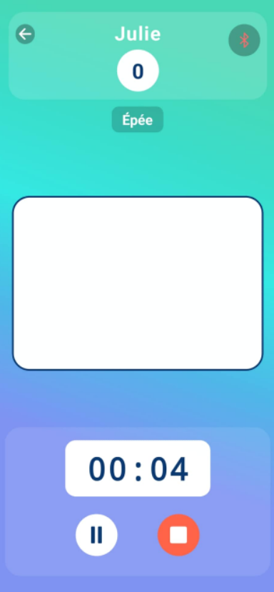
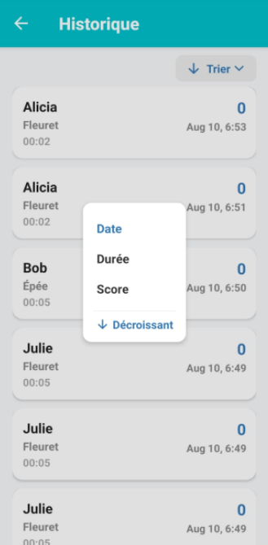
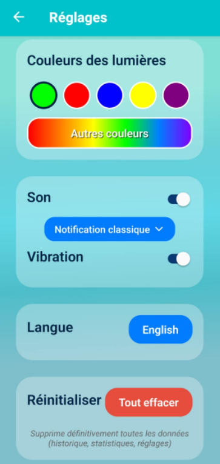
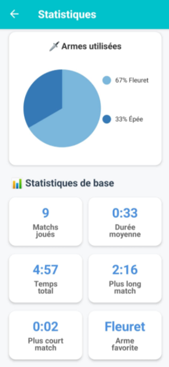
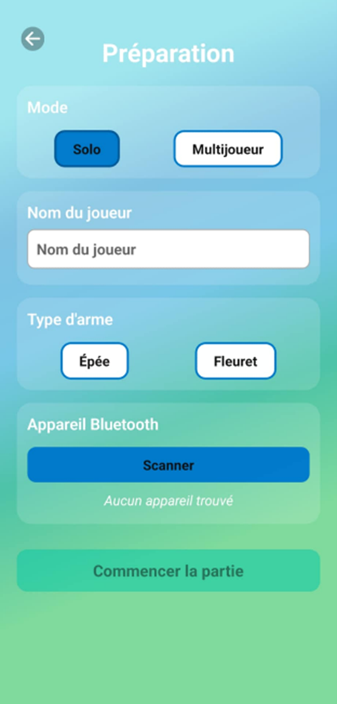

<h1 align="center" style="font-size: 42px; margin-bottom: 10px;">
🤺 FencingPro 🤺
</h1>

**FencingPro** est une application mobile développée avec React Native permettant de gérer des matchs d’escrime en temps réel. Elle intègre un système de détection de touches sans fil grâce à la communication *Bluetooth Low Energy* (BLE) entre l’application et des modules électroniques intégrés à l’équipement.

   

## Aperçu

Une application pensée pour les tireurs et entraîneurs : détection de touches sans fil, chronomètre, comptage automatique, historique et statistiques.

| 🏠 Accueil | 🎮 Jeu | 📜 Historique |
|:-----------:|:------:|:--------------:|
|  |  |  |

| ⚙️ Réglages | 📊 Statistiques | 🖥️ Configuration |
|:-----------:|:------:|:--------------:|
|  |  |  |

## Fonctionnalités principales

- Connexion Bluetooth Low Energy (BLE) aux modules ESP32 / nRF52840
- Détection de touches en temps réel (READ + NOTIFY)
- Score en temps réel et chronomètre
- Démarrage, pause et reprise du chronomètre avec alertes visuelles et sonores
- Modes solo et multijoueur
- Historique des matchs (ajout automatique à la fin d'une partie)
- Tri, filtres et suppression (swipe-to-delete) dans l'historique
- Statistiques visuelles : graphiques d'activité, progression, performance par arme, etc.
- Réglages : langue, couleurs des lumières, sons, vibrations, réinitialisation des données

## Installation
L’application sera bientôt disponible sur le *Google Play Store* 🎉  
(Actuellement en attente d’approbation sur la Play Console, donc accessible uniquement via une liste de distribution privée pour le moment.)

### Accès Testeurs
Tu veux essayer l’application avant sa sortie officielle ?  
Entre ton adresse Gmail ici pour être ajouté à la liste des testeurs sur le Play Store : [Remplir le formulaire d’accès](https://katiakaci.github.io/FencingPro/access.html)

### Installation locale pour développement

1. Cloner le projet
git clone https://github.com/katia-kaci/FencingPro.git
cd FencingPro

2. Installer les dépendances
npm install

3. Lancer le projet
npx expo start

Ouvrir ensuite l’application Expo Go sur un appareil mobile et scanner le code QR affiché dans le terminal pour exécuter FencingPro.

## Communication Bluetooth

- Service UUID : 12345678-1234-5678-1234-56789abcdef0
- Characteristic UUID : 12345678-1234-5678-1234-56789abcdef1
- Propriétés : READ + NOTIFY
- Type de données : bool (1 octet)

L’application se connecte automatiquement au module détecté, lit la caractéristique et s’abonne aux notifications pour détecter les touches.

## Améliorations futures
- Système d'authentification / sauvegarde cloud : Intégrer Firebase pour synchroniser l'historique et les statistiques
- Export CSV / partage des statistiques
- Interface d'administration des matchs dans l'historique (édition d'une entrée sans se connecter en Bluetooth).

## Crédits
Ce projet a été réalisé dans le cadre d’un projet de fin d’études en génie logiciel à l’ÉTS. Contributeurs :
- Vincent Martins Dos Santos (Conception électronique et mécanique)
- Jacob Curiel-Garfias (Conception électronique et mécanique)
- Katia Kaci (Programmation et développement mobile)
